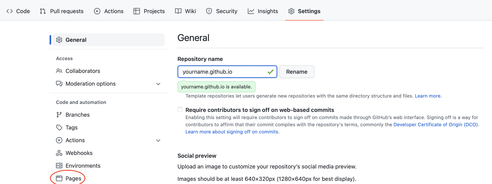

# How To Create Your GitHub Page
[visit this demo](https://creatorcao.github.io/) 

1. **Fork** this repository and change it to your name (yourname.github.io)

2. Go to **Settings** --> **Pages** and **Choose a theme**

3. Click ***_config.yml*** above to get started and fill in the details. 

4. Then click ***index.md*** and edit it to start creating your home page.
